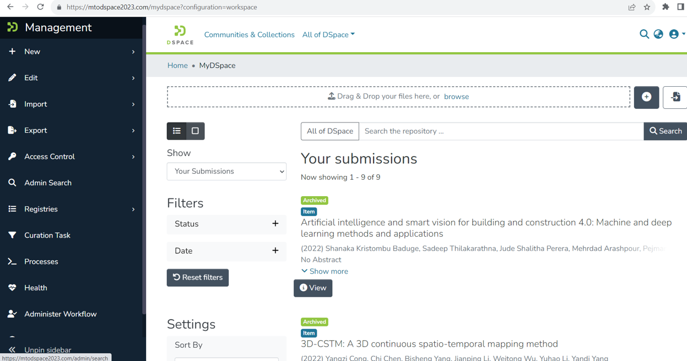

# Digital Repository for Remote Inspection Methods

  

As a Software Engineering Research Assistant, I developed a comprehensive digital repository system tailored for construction site inspection documentation. The project involved customizing the open-source DSpace framework to create a scalable, secure platform for managing construction site data. On the frontend, I built a responsive interface using Node.js and JavaScript, focusing on intuitive navigation and efficient data access patterns. The backend architecture was designed for robust performance and reliability. I implemented PostgreSQL for structured data storage, integrated Apache Solr for advanced search capabilities, and configured Apache Tomcat 9 as the servlet engine. This combination provided powerful data management capabilities while maintaining system responsiveness. For deployment, I designed a sophisticated AWS infrastructure utilizing EC2 instances with Auto Scaling groups to handle varying loads efficiently. Security was implemented at multiple levels throughout the system. I configured SSL/TLS certificates for encrypted communication, implemented custom domain routing through AWS Route 53, and established comprehensive network security through carefully configured security groups and firewall rules. The deployment included Elastic Load Balancing for high availability and automated scaling. Throughout development, I conducted extensive testing including release simulations and user acceptance testing, ensuring the system met all performance and security requirements while maintaining reliable operation. 

  
   
  Main page showing the system dashboard and control interface

## Technologies: Node.js, JavaScript, PostgreSQL, Linux, AWS (EC2, Route 53, ELB), Apache Solr, Tomcat 9
